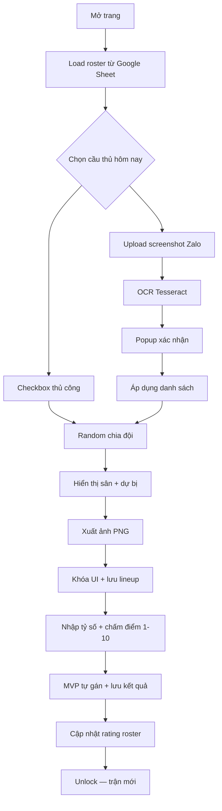

# DIAMOND UNITED FC — Sân 7

Ứng dụng web một trang (single-page) giúp CLB **DIAMOND UNITED FC** chọn danh sách tham gia, chia đội cân bằng, xếp đội hình theo sơ đồ sân 7, và xuất ảnh đội hình.

**Build hiện tại:** v1.12.0 (xem `index.html`)

## Tính năng

| Tính năng | Mô tả |
|-----------|--------|
| Danh sách thành viên | Load tự động từ Google Sheet khi mở trang |
| Chọn cầu thủ | Checkbox, tìm kiếm, chọn/bỏ chọn tất cả |
| OCR từ screenshot | Upload ảnh Zalo → Tesseract nhận diện tên → popup xác nhận |
| Random chia đội | Thuật toán cân bằng rating, vị trí, quân số |
| Sơ đồ sân 7 | 4 formation: `3-2-1`, `3-1-2`, `2-3-1`, `2-2-2` (mỗi đội chọn riêng) |
| Hiển thị đội hình | Sân bóng 2D, đội trưởng, dự bị, badge rating |
| Xuất ảnh | `html2canvas` → PNG, lưu lineup vào Sheet |
| Khóa & chấm điểm | Sau xuất ảnh → nhập tỷ số + điểm 1–10 từng người + MVP |
| Cập nhật rating | 8–10: +1 · 6–7: 0 · 1–5: -1 → ghi vào sheet thành viên |
| Lịch sử trận | Tab xem lại tỷ số, MVP, điểm cá nhân, thay đổi rating |

## Chạy ứng dụng

Không cần build. Mở trực tiếp `index.html` trên trình duyệt, hoặc host tĩnh (GitHub Pages, Netlify, v.v.).

```bash
# Ví dụ chạy local
python3 -m http.server 8080
# Mở http://localhost:8080/index.html
```

**Lưu ý:** Cần kết nối mạng để tải CDN (XLSX, html2canvas, Tesseract) và fetch Google Sheet.

## Cấu trúc dự án

```
diamondunitedfc/
├── index.html           # Toàn bộ UI + logic (HTML, CSS, JS)
├── apps-script/
│   ├── Code.gs          # Backend Google Apps Script
│   └── README.md        # Hướng dẫn deploy Web App
├── members.csv          # Mẫu dữ liệu cũ (app hiện load từ Google Sheet)
└── README.md
```

## Nguồn dữ liệu

### Google Sheet (danh sách thành viên)

URL CSV được hard-code trong `index.html`:

```
GOOGLE_SHEET_CSV_URL
```

**Cột bắt buộc:**

| Cột | Alias (tiếng Việt) | Ví dụ | Ghi chú |
|-----|-------------------|-------|---------|
| `name` | `tên`, `ten` | `Thang Phan` | Bắt buộc |
| `position` | `vị trí`, `vi_tri` | `MID, FWD, DEF` | Giá trị đầu = vị trí chính, sau = phụ. Giá trị hợp lệ: `GK`, `DEF`, `MID`, `FWD` |

**Cột tùy chọn:**

| Cột | Alias | Ví dụ | Ghi chú |
|-----|-------|-------|---------|
| `rating` | `điểm`, `diem` | `9` | Mặc định `5` |
| `avatar` | `ảnh`, `anh`, `avatar_url` | URL hoặc path | Không có → tạo avatar chữ cái qua ui-avatars.com |
| `preferred_side` | `khu vực`, `side` | `CENTER, RIGHT, LEFT` | Giá trị đầu = khu vực chính |
| `secondary_positions` | `vị trí phụ` | `DEF/MID` | Chỉ dùng khi file cũ tách riêng cột phụ |

### `members.csv` (legacy)

File mẫu dùng format cũ: `name`, `main_position`, `secondary_positions`, `rating`, `avatar`. App **không** đọc file này trực tiếp — chỉ tham khảo format.

## Luồng sử dụng



1. Trang tự load danh sách thành viên.
2. Chọn ai tham gia hôm nay (tối thiểu **14 người** để chia 2 đội sân 7).
3. Bấm **Random chia đội** → countdown + animation bốc thăm.
4. Đổi sơ đồ từng đội nếu cần (tự tối ưu lại xếp vị trí).
5. Bấm **Xuất hình ảnh đội hình** → tải PNG + khóa UI + mở form kết quả.
6. Nhập **tỷ số** (bắt buộc), chấm **điểm 1–10** từng người (kể cả dự bị).
7. Bấm **Lưu kết quả** → cập nhật rating + xem lại ở tab **Lịch sử trận**.

### Hai hệ thống tách biệt

**Rating** — đánh giá chất lượng cầu thủ, dùng khi **chia 2 đội cân bằng**:

| Điểm sau trận | Thay đổi rating |
|---------------|-----------------|
| 8, 9, 10 | +1 |
| 6, 7 | 0 (giữ nguyên) |
| 1, 2, 3, 4, 5 | -1 |

Rating mới = `clamp(rating_hiện_tại + delta, 1, 10)` → cột `rating` sheet Player.

**MVP** — thành tích riêng, **không ảnh hưởng rating**, dùng **thống kê top MVP cuối năm**:

- Mỗi trận, mỗi đội chọn **1 người điểm cao nhất** trong đội
- Người đó `mvp_count + 1` → cột `mvp_count` sheet Player

## Kiến trúc code (`index.html`)

Toàn bộ logic nằm trong một file, chia theo nhóm chức năng:

### 1. Cấu hình & hằng số

```js
POS              // ["GK","DEF","MID","FWD"]
FORMATIONS       // slot vị trí + side cho mỗi sơ đồ
FORMATION_COORDS // tọa độ % trên sân
GOOGLE_SHEET_CSV_URL
MATCH_HISTORY_WEB_APP_URL
```

### 2. Dữ liệu & UI danh sách

| Hàm | Vai trò |
|-----|---------|
| `loadDefaultRoster()` | Fetch CSV từ Google Sheet, parse bằng SheetJS (`XLSX`) |
| `applyRows(rows)` | Chuẩn hóa row → object `players[]` |
| `renderPlayerPicker()` | Render checkbox + search |
| `updateStats()` | Cập nhật metric tổng / đã chọn |

### 3. OCR screenshot

| Hàm | Vai trò |
|-----|---------|
| `detectPlayersFromScreenshot()` | Gọi Tesseract `vie+eng` trên từng ảnh |
| `detectNamesFromOcrText()` | Match tên roster với text OCR (exact → fuzzy) |
| `openConfirmModal()` / `applyConfirmedPlayers()` | Popup xác nhận trước khi áp dụng |

**Xử lý đặc biệt OCR:** Chuẩn hóa bỏ dấu, sửa `Ban`/`Bạn` → `Thang Phan`, bỏ prefix `DC -` (format Zalo).

### 4. Thuật toán chia đội

**Bước 1 — Chia 2 đội (`randomBest`):**

- Chạy ~900 lần `splitByRatingBalanced`: greedy xếp từng cầu thủ vào đội có điểm cân bằng tốt hơn.
- Tiêu chí `fastSplitScore` / `splitCandidateScore`:
  - Chênh lệch quân số
  - Tổng rating
  - Phân bố rating từng mức (9–10 nặng hơn)
  - Số người cover được từng vị trí (`GK/DEF/MID/FWD`)
  - Luật ẩn: **Minh Phat** và **Thang Phan** không được cùng đội
- Giữ top 40 phương án, chọn tốt nhất qua `evalSplit`.

**Bước 2 — Xếp đội hình (`build`):**

- Backtracking + memo cho 7 slot theo formation.
- `assignmentScore(player, slot)` ưu tiên theo thứ tự:
  1. Vị trí chính + side chính
  2. Vị trí chính + side phụ
  3. Vị trí chính + lệch side
  4. Vị trí phụ
  5. Trái vị trí
- Trong cùng tier, **rating cao hơn thắng**.
- **Minh Phat** và **Thang Phan** bắt buộc ra sân (đội trưởng), không ngồi dự bị.

**Đổi formation sau random:** `setFormation()` gọi lại `evalSplit` trên cùng `teamA`/`teamB`, chỉ tối ưu lại xếp slot.

### 5. Render sân & animation

| Hàm | Vai trò |
|-----|---------|
| `startRandom()` | Điều phối suspense → random → reveal |
| `revealBothLineups()` | Đội trưởng trước, sau đó xen kẽ A/B |
| `getPosCoord()` | Map vị trí + side → % trên sân |
| `cardHtml()` | Thẻ cầu thủ (rating, captain badge, fit label) |

### 6. Xuất ảnh & lịch sử

| Hàm | Vai trò |
|-----|---------|
| `exportImage()` | Clone DOM → `html2canvas` → download PNG |
| `makeImagesExportSafe()` | Convert avatar sang data URL (tránh CORS) |
| `saveMatchHistoryToSheet()` | POST JSON tới Google Apps Script Web App |

Backend nằm trong `apps-script/Code.gs`. Xem [apps-script/README.md](apps-script/README.md) để deploy.

| Action | Mô tả |
|--------|-------|
| `save_match_history` | Lưu lineup (status: `lineup_exported`) |
| `save_match_result` | Lưu tỷ số, điểm cá nhân, MVP, cập nhật rating |
| `get_match_list` | Đọc lịch sử trận đã hoàn tất |
| `get_match_detail` | Chi tiết 1 trận |

Sheets: **Match History** (chi tiết cầu thủ), **Match Summary** (tổng trận), **Rating Log** (audit rating).

## Thư viện bên ngoài (CDN)

| Thư viện | Phiên bản | Dùng cho |
|----------|-----------|----------|
| [SheetJS](https://sheetjs.com/) | 0.18.5 | Parse CSV từ Google Sheet |
| [html2canvas](https://html2canvas.hertzen.com/) | 1.4.1 | Chụp DOM thành PNG |
| [Tesseract.js](https://tesseract.projectnaptha.com/) | 5.x | OCR screenshot tiếng Việt + Anh |

## Luật nghiệp vụ đặc biệt

- Tối thiểu **14** cầu thủ được chọn mới random được.
- Mỗi đội (≥7 người) cần cover đủ `GK`, `DEF`, `MID`, `FWD` (chính hoặc phụ).
- Chênh lệch quân số 2 đội tối đa **1** người.
- **Minh Phat** + **Thang Phan**: khác đội, luôn đá chính, hiển thị badge đội trưởng `C`.

## Phát triển / chỉnh sửa

| Muốn thay đổi | Sửa ở đâu |
|---------------|-----------|
| URL Google Sheet | `GOOGLE_SHEET_CSV_URL` |
| Sơ đồ mặc định | `formationA`, `formationB`, `<select>` HTML |
| Tọa độ trên sân | `FORMATION_COORDS` |
| Luật đội trưởng | `forcedNames` trong `build()` |
| Luật chia đội ẩn | `violatesHiddenRule()` |
| Version hiển thị | `.buildVersion` trong HTML |

## Giới hạn đã biết

- OCR phụ thuộc chất lượng ảnh và font Zalo; có thể nhận nhầm tên ngắn.
- `saveMatchHistoryToSheet` dùng `mode: "no-cors"` — không đọc được response, chỉ biết đã gửi request.
- Avatar từ domain không hỗ trợ CORS sẽ fallback sang SVG chữ cái khi xuất ảnh.
